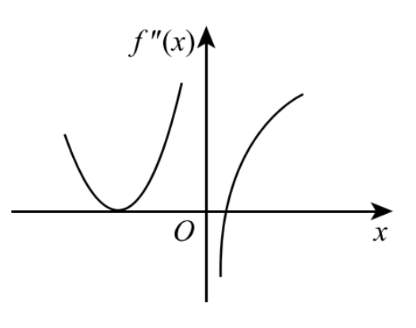

# 2015 年全国硕士研究生招生考试 数学（一）

考试时间：180 分钟 满分：150 分

## 一、选择题（1~10 小题，每小题 5 分，共 50 分）

(1) 设函数 $f(x)$ 在 $(-\infty, +\infty)$ 上连续，其 2 阶导函数 $f''(x)$ 的图形如右图所示，则曲线 $y = f(x)$ 的拐点个数为 ( ) 
(A) 0.
(B) 1.
(C) 2.
(D) 3.

(2) 设 $y = \frac{1}{2}\mathrm{e}^{2x} + \left(x - \frac{1}{3}\right)\mathrm{e}^{x}$ 是二阶常系数非齐次线性微分方程 $y'' + ay' + by = c\mathrm{e}^{x}$ 的一个特解，则 ( )
(A) $a = -3, b = 2, c = -1$.
(B) $a = 3, b = 2, c = -1$.
(C) $a = -3, b = 2, c = 1$.
(D) $a = 3, b = 2, c = 1$.

(3) 若级数 $\sum_{n=1}^{\infty} a_n$ 条件收敛，则 $x = \sqrt{3}$ 与 $x = 3$ 依次为幂级数 $\sum_{n=1}^{\infty} na_n(x - 1)^n$ 的 ( )
(A) 收敛点，收敛点.
(B) 收敛点，发散点.
(C) 发散点，收敛点.
(D) 发散点，发散点.

(4) 设 $D$ 是第一象限中的曲线 $2xy = 1, 4xy = 1$ 与直线 $y = x, y = \sqrt{3}x$ 围成的平面区域，函数 $f(x,y)$ 在 $D$ 上连续，则 $\iint_D f(x,y)\,\mathrm{d}x\mathrm{d}y = $ ( )
(A) $\int_{\frac{\pi}{4}}^{\frac{\pi}{3}} \mathrm{d}\theta \int_{\frac{1}{2\sin 2\theta}}^{\frac{1}{\sin 2\theta}} f(r\cos \theta, r\sin \theta)r\mathrm{d}r$.
(B) $\int_{\frac{\pi}{4}}^{\frac{\pi}{3}} \mathrm{d}\theta \int_{\frac{1}{\sqrt{2\sin 2\theta}}}^{\frac{1}{\sqrt{\sin 2\theta}}} f(r\cos \theta, r\sin \theta)r\mathrm{d}r$.
(C) $\int_{\frac{\pi}{4}}^{\frac{\pi}{3}} \mathrm{d}\theta \int_{\frac{1}{2\sin 2\theta}}^{\frac{1}{\sin 2\theta}} f(r\cos \theta, r\sin \theta)\mathrm{d}r$.
(D) $\int_{\frac{\pi}{4}}^{\frac{\pi}{3}} \mathrm{d}\theta \int_{\frac{1}{\sqrt{2\sin 2\theta}}}^{\frac{1}{\sqrt{\sin 2\theta}}} f(r\cos \theta, r\sin \theta)\mathrm{d}r$.

(5) 设矩阵

$$
A = \begin{pmatrix}
1 & 1 & 1 \\
1 & 2 & a \\
1 & 4 & a^2
\end{pmatrix}, \quad
\boldsymbol{b} = \begin{pmatrix}
1 \\
d \\
d^2
\end{pmatrix}.
$$

若集合 $\Omega = \{1,2\}$，则线性方程组 $A\boldsymbol{x} = \boldsymbol{b}$ 有无穷多解的充分必要条件为 ( )

(A) $a \notin \Omega, d \notin \Omega$.
(B) $a \notin \Omega, d \in \Omega$.
(C) $a \in \Omega, d \notin \Omega$.
(D) $a \in \Omega, d \in \Omega$.

---

(6) 设二次型 $f(x_1,x_2,x_3)$ 在正交变换 $\boldsymbol{x} = P\boldsymbol{y}$ 下的标准形为 $2y_1^2 + y_2^2 - y_3^2$，其中 $P = (\boldsymbol{e}_1,\boldsymbol{e}_2,\boldsymbol{e}_3)$。若 $Q = (\boldsymbol{e}_1,-\boldsymbol{e}_3,\boldsymbol{e}_2)$，则 $f(x_1,x_2,x_3)$ 在正交变换 $\boldsymbol{x} = Q\boldsymbol{y}$ 下的标准形为 ( )

(A) $2y_1^2 - y_2^2 + y_3^2$.
(B) $2y_1^2 + y_2^2 - y_3^2$.
(C) $2y_1^2 - y_2^2 - y_3^2$.
(D) $2y_1^2 + y_2^2 + y_3^2$.

---

(7) 若 $A,B$ 为任意两个随机事件，则 ( )

(A) $P(AB) \leqslant P(A)P(B)$.
(B) $P(AB) \geqslant P(A)P(B)$.
(C) $P(AB) \leqslant \frac{P(A) + P(B)}{2}$.
(D) $P(AB) \geqslant \frac{P(A) + P(B)}{2}$.

(8) 设随机变量 $X,Y$ 不相关，且 $E(X) = 2,\ E(Y) = 1,\ D(X) = 3$，则 $E\left[X(X + Y - 2)\right] = $ ( )

(A) $-3$.
(B) $3$.
(C) $-5$.
(D) $5$.

## 二、填空题（11~16 小题，每小题 5 分，共 30 分）

(9)

$$
\lim_{x \to 0} \frac{\ln(\cos x)}{x^2} = \underline{\quad\quad}
$$

(10)

$$
\int_{-\frac{\pi}{2}}^{\frac{\pi}{2}} \left( \frac{\sin x}{1 + \cos x} + |x| \right) \mathrm{d}x = \underline{\quad\quad}
$$

(11)
若函数 $z = z(x,y)$ 由方程 $\mathrm{e}^z + xyz + x + \cos x = 2$ 确定，则 $\mathrm{d}z \big|_{(0,1)} = \underline{\quad\quad}$

(12)
设 $\Omega$ 是由平面 $x + y + z = 1$ 与三个坐标平面所围成的空间区域，则

$$
\iiint_{\Omega} (x + 2y + 3z) \,\mathrm{d}x\mathrm{d}y\mathrm{d}z = \underline{\quad\quad}
$$

(13)
$n$ 阶行列式

$$
\begin{vmatrix}
2 & 0 & \cdots & 0 & 2 \\
-1 & 2 & \cdots & 0 & 2 \\
\vdots & \vdots & & \vdots & \vdots \\
0 & 0 & \cdots & 2 & 2 \\
0 & 0 & \cdots & -1 & 2
\end{vmatrix}
= \underline{\quad\quad}
$$

(14)
设二维随机变量 $(X,Y)$ 服从正态分布 $N(1,0;1,1;0)$，则 $P\{XY - Y < 0\} = \underline{\quad\quad}$

## 三、解答题（17~22 小题，共 70 分）

(15) (本题满分 10 分)

设函数 $f(x) = x + a\ln(1 + x) + bx\sin x$, $g(x) = kx^3$. 若 $f(x)$ 与 $g(x)$ 在 $x \to 0$ 时是等价无穷小, 求 $a,b,k$ 的值.

---

(16) (本题满分 10 分)

设函数 $f(x)$ 在定义域 $I$ 上的导数大于零. 若对任意的 $x_0 \in I$, 曲线 $y = f(x)$ 在点 $(x_0, f(x_0))$ 处的切线与直线 $x = x_0$ 及 $x$ 轴所围成区域的面积恒为 $4$, 且 $f(0) = 2$, 求 $f(x)$ 的表达式.

---

(17) (本题满分 10 分)

已知函数 $f(x,y) = x + y + xy$, 曲线 $C: x^2 + y^2 + xy = 3$, 求 $f(x,y)$ 在曲线 $C$ 上的最大方向导数.

(18) (本题满分 10 分)

(Ⅰ) 设函数 $u(x),v(x)$ 可导，利用导数定义证明 $[u(x)v(x)]' = u'(x)v(x) + u(x)v'(x)$；

(Ⅱ) 设函数 $u_1(x),u_2(x),\cdots,u_n(x)$ 可导，$f(x) = u_1(x)u_2(x)\cdots u_n(x)$，写出 $f(x)$ 的求导公式。

---

(19) (本题满分 10 分)

已知曲线 $L$ 的方程为

$$
\begin{cases}
z = \sqrt{2 - x^2 - y^2}, \\
z = x,
\end{cases}
$$

起点为 $A(0,\sqrt{2},0)$，终点为 $B(0,-\sqrt{2},0)$，计算曲线积分

$$
I = \int_L (y + z)\,\mathrm{d}x + (z^2 - x^2 + y)\,\mathrm{d}y + x^2y^2\,\mathrm{d}z.
$$

(20) (本题满分 11 分)

设向量组 $\boldsymbol{\alpha}_1,\boldsymbol{\alpha}_2,\boldsymbol{\alpha}_3$ 为 $\mathbb{R}^3$ 的一个基，$\boldsymbol{\beta}_1 = 2\boldsymbol{\alpha}_1 + 2k\boldsymbol{\alpha}_3$，$\boldsymbol{\beta}_2 = 2\boldsymbol{\alpha}_2$，$\boldsymbol{\beta}_3 = \boldsymbol{\alpha}_1 + (k + 1)\boldsymbol{\alpha}_3$。

(Ⅰ) 证明向量组 $\boldsymbol{\beta}_1,\boldsymbol{\beta}_2,\boldsymbol{\beta}_3$ 为 $\mathbb{R}^3$ 的一个基；

(Ⅱ) 当 $k$ 为何值时，存在非零向量 $\boldsymbol{\xi}$ 在基 $\boldsymbol{\alpha}_1,\boldsymbol{\alpha}_2,\boldsymbol{\alpha}_3$ 与基 $\boldsymbol{\beta}_1,\boldsymbol{\beta}_2,\boldsymbol{\beta}_3$ 下的坐标相同，并求所有的 $\boldsymbol{\xi}$。

---

(21) (本题满分 11 分)

设矩阵

$$
A = \begin{pmatrix}
0 & 2 & -3 \\
-1 & 3 & -3 \\
1 & -2 & a
\end{pmatrix}
$$

相似于矩阵

$$
B = \begin{pmatrix}
1 & -2 & 0 \\
0 & b & 0 \\
0 & 3 & 1
\end{pmatrix}.
$$

(Ⅰ) 求 $a,b$ 的值；

(Ⅱ) 求可逆矩阵 $P$，使 $P^{-1}AP$ 为对角矩阵。

(22) (本题满分 11 分)

设随机变量 $X$ 的概率密度为

$$
f(x) =
\begin{cases}
2^{-x}\ln 2, & x > 0, \\
0, & x \leqslant 0.
\end{cases}
$$

对 $X$ 进行独立重复的观测，直到第 2 个大于 3 的观测值出现时停止，记 $Y$ 为观测次数。

(Ⅰ) 求 $Y$ 的概率分布；

(Ⅱ) 求 $E(Y)$。

---

(23) (本题满分 11 分)

设总体 $X$ 的概率密度为

$$
f(x;\theta) =
\begin{cases}
\dfrac{1}{1 - \theta}, & \theta \leqslant x \leqslant 1, \\[6pt]
0, & \text{其他},
\end{cases}
$$

其中 $\theta$ 为未知参数。$X_1,X_2,\cdots,X_n$ 为来自该总体的简单随机样本。

(Ⅰ) 求 $\theta$ 的矩估计量；

(Ⅱ) 求 $\theta$ 的最大似然估计量。
