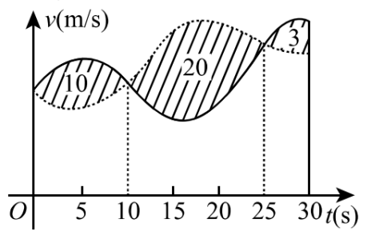

# 2017 年全国硕士研究生招生考试 数学（一）

考试时间：180 分钟 满分：150 分

## 一、选择题（1~10 小题，每小题 5 分，共 50 分）

(1) 若函数

$$
f(x) =
\begin{cases}
\frac{1 - \cos\sqrt{x}}{ax}, & x > 0, \\
b, & x \le 0
\end{cases}
$$

在 $x = 0$ 处连续，则$\underline{\quad\quad}$。
A. $ab = \frac{1}{2}$
B. $ab = -\frac{1}{2}$
C. $ab = 0$
D. $ab = 2$

---

(2) 设函数 $f(x)$ 可导，且 $f(x)f'(x) > 0$，则$\underline{\quad\quad}$。
A. $f(1) > f(-1)$
B. $f(1) < f(-1)$
C. $|f(1)| > |f(-1)|$
D. $|f(1)| < |f(-1)|$

---

(3) 函数 $f(x,y,z) = x^2y + z^2$ 在点 $(1,2,0)$ 处沿向量 $\boldsymbol{n} = (1,2,2)$ 的方向导数为$\underline{\quad\quad}$。
A. 12
B. 6
C. 4
D. 2

---

(4) 甲、乙两人赛跑，计时开始时，甲在乙前方 $10$（单位：$\mathrm{m}$）处。图中，实线表示甲的速度曲线 $v = v_1(t)$（单位：$\mathrm{m/s}$），虚线表示乙的速度曲线 $v = v_2(t)$，三块阴影部分面积的数值依次为 $10,20,3$。计时开始后乙追上甲的时刻记为 $t_0$（单位：$\mathrm{s}$），则$\underline{\quad\quad}$。
A. $t_0 = 10$
B. $15 < t_0 < 20$
C. $t_0 = 25$
D. $t_0 > 25$

---

(5) 设 $\boldsymbol{\alpha}$ 为 $n$ 维单位列向量，$\boldsymbol{E}$ 为 $n$ 阶单位矩阵，则$\underline{\quad\quad}$。
A. $\boldsymbol{E} - \boldsymbol{\alpha}\boldsymbol{\alpha}^\top$ 不可逆
B. $\boldsymbol{E} + \boldsymbol{\alpha}\boldsymbol{\alpha}^\top$ 不可逆
C. $\boldsymbol{E} + 2\boldsymbol{\alpha}\boldsymbol{\alpha}^\top$ 不可逆
D. $\boldsymbol{E} - 2\boldsymbol{\alpha}\boldsymbol{\alpha}^\top$ 不可逆

---

(6) 已知矩阵

$$
\boldsymbol{A} = \begin{pmatrix} 2 & 0 & 0 \\ 0 & 2 & 1 \\ 0 & 0 & 1 \end{pmatrix},\quad
\boldsymbol{B} = \begin{pmatrix} 2 & 1 & 0 \\ 0 & 2 & 0 \\ 0 & 0 & 1 \end{pmatrix},\quad
\boldsymbol{C} = \begin{pmatrix} 1 & 0 & 0 \\ 0 & 2 & 0 \\ 0 & 0 & 2 \end{pmatrix},
$$

则$\underline{\quad\quad}$。
A. $\boldsymbol{A}$ 与 $\boldsymbol{C}$ 相似，$\boldsymbol{B}$ 与 $\boldsymbol{C}$ 相似
B. $\boldsymbol{A}$ 与 $\boldsymbol{C}$ 相似，$\boldsymbol{B}$ 与 $\boldsymbol{C}$ 不相似
C. $\boldsymbol{A}$ 与 $\boldsymbol{C}$ 不相似，$\boldsymbol{B}$ 与 $\boldsymbol{C}$ 相似
D. $\boldsymbol{A}$ 与 $\boldsymbol{C}$ 不相似，$\boldsymbol{B}$ 与 $\boldsymbol{C}$ 不相似

## 二、填空题（11~16 小题，每小题 5 分，共 30 分）

## 三、解答题（17~22 小题，共 70 分）
